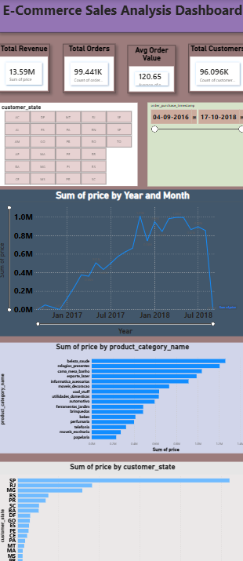
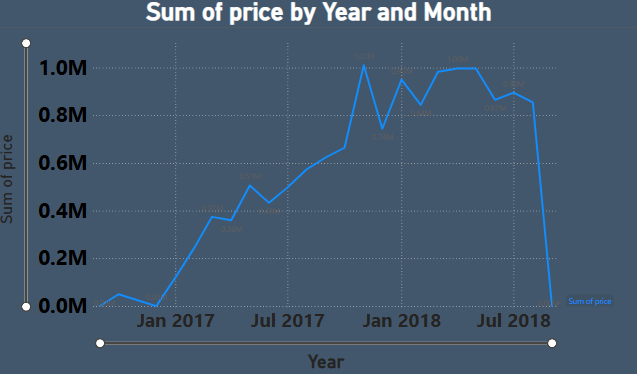
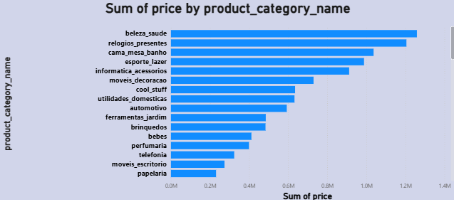
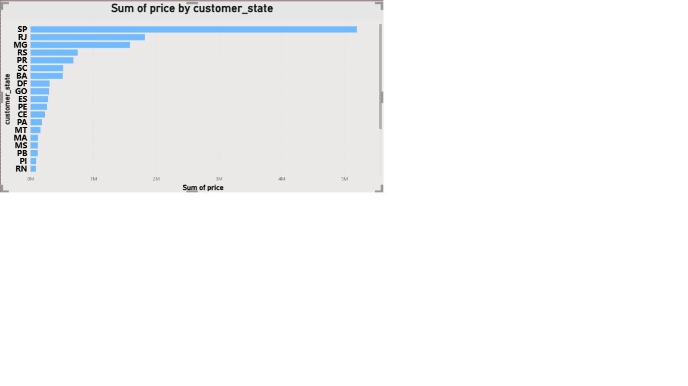

# E-Commerce Sales Analysis

Analyzed e-commerce sales data using SQL, Excel, and Power BI to uncover monthly sales trends, category performance, regional revenue distribution, and customer repeat-purchase behavior.

## Tools Used
- **SQL** (MySQL) — Joins, Aggregations, CTEs, Subqueries
- **Excel** — Pivot Tables & Pivot Charts
- **Power BI** — Interactive dashboard with slicers
- **Python** (pandas, SQLAlchemy) — Data import pipeline

## Dataset
Brazilian E-Commerce Public Dataset by Olist (via Kaggle) — ~100K orders across 2016-2018.

## Process
1. Cleaned and loaded raw CSV data into MySQL using Python (pandas + SQLAlchemy)
2. Wrote SQL queries using Joins, CTEs, and subqueries to calculate key metrics
3. Built Pivot Tables and Charts in Excel for exploratory analysis
4. Designed an interactive Power BI dashboard with KPI cards, charts, and slicers

## Key Metrics Analyzed
- **Monthly Sales Velocity** — Revenue and order trends over time
- **Category Performance** — Top-performing product categories by revenue
- **Regional Revenue** — State-wise sales distribution across Brazil
- **Repeat Orders** — Customer retention analysis (One-time vs Repeat customers)

## Key Insights
- Total Revenue: **13.59M** | Total Orders: **99,441** | Avg Order Value: **120.65**
- **São Paulo (SP)** generates the highest revenue among all states
- **beleza_saude** and **relogios_presentes** are the top revenue-generating categories
- **97% of customers are one-time buyers**, only 3% are repeat customers — highlighting an opportunity for retention strategies

## Dashboard Preview

### Monthly Sales Trend

### Category Performance

### Regional Revenue

## Files
- `queries.sql` — All SQL queries used for analysis
- `data.ipynb` — Python script for data import into MySQL
- `E commerce data analysis.xlsx` — Excel file with Pivot Tables and Charts
